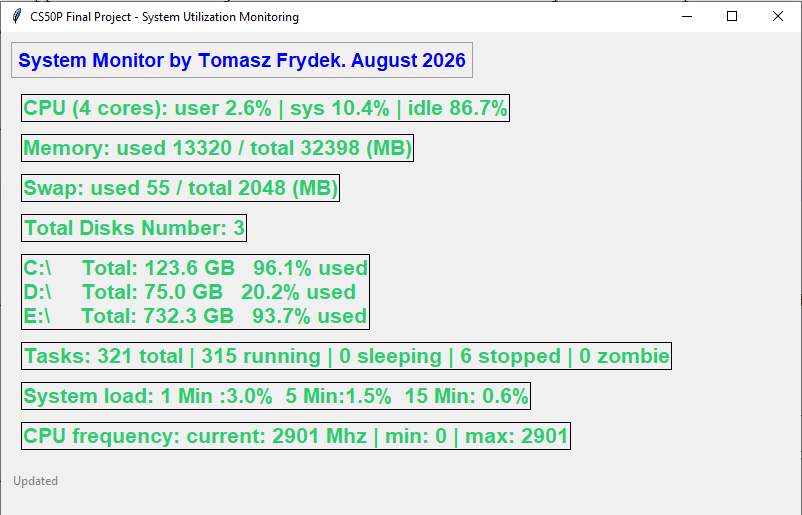
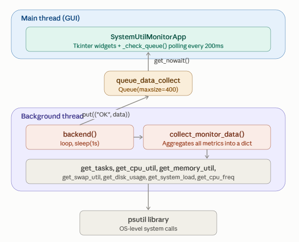

  # SYSTEM UTILIZATION MONITORING
  #### Video Demo:  https://youtu.be/_ojq_Ui8UiI?si=41P9EJVJz1PbM1Ui
  #### Description:

  This application collects important information on running processes and system utilization like CPU data, memory, disk, partitions, CPU frequency, system load, tasks running etc. It can run on Windows and Linux Operating Systems.
  Collected data are displayed on graphical interace using Tkinter. The `tkinter` package (“Tk interface”) is the standard Python interface to the Tcl/Tk GUI toolkit.

  Libraries used in this project: `tkinter`, `psutil`, `threading`, `queue`





**Codes description**

Main core of the application is the `psutil` library.
Using its power the application retrieves many useful information about running system which can help to get better insight about system utilization.

### Following diagram depicts the data flow and software architecture of the application:


Following functions are implemented to retrive system data:
- `get_tasks` - this function returns information about running tasks on the system. It delivers number of total processes on the system, number of sleeping processes, number of running, stopped and zombie processes.

- `get_cpu_count` - this function returns number of phusical CPU cores on the system

- `get_cpu_util` - this function returns utilization in percent for different specific CPU times i.e. user (time spent by normal processes executing in user mode), system (time spent by processes executing in kernel mode) and idle (time spent doing nothing).

- `get_memory_util` - this function returns statistics about system memory usage in mega bytes including total, free and used memory.

- `get_swap_util` - this function returns system swap memory statistics in mega bytes including total, free and used memory.

- `get_disk_usage` - this function returns disk statistics in bytes including total disk space, used disk space, free disk space and dusi usage in percent. This function automaticaly detects all partitions in the system and delivers mentioned statistics for all partitions.

- `get_disk_partitions` - this function returns a list of all mounted disk partitions.

- `get_system_load` - this function returns the average system load over the last 1, 5 and 15 minutes as percentage representation.

- `get_cpu_freq` - this function returns current, min and max CPU frequency expressed in Mhz.


- `collect_monitor_data` - single function running in separate thread which gathers all data from above mentioned functions and puts them into `FIFO queue`.

- `backend` - This function runs in thread and calls `collect_monitor_data` every 1 second and puts collected data into the `FIFO queue`


To represent the collected data in reasonable way, an graphical interface in `Tkinter` is implemented. It pulls data from `FIFO queue` and updates with them the `GUI` in `Tkinter`.

The GUI in Tkinter is implemented as single class `SystemUtilMonitorApp` which inherits from `tk.Tk`

In its init method the interface size, title and couple of internal Tkinter variables are declared.
The `SystemUtilMonitorApp` includes also some additional private methods:
- `_check_queue` - it continously checks if new correct data are available in the `FIFO queue` and pulls them to update the graphical widget on GUI.

- `_build_widgets` - it builds base structure for graphical widgets during class instance creation.

- `_update_widgets` - this method is called continously in `_check_queue` to populate GUI widget with data pulled from `FIFO queue`.


The `main` function of the project starts thread which calls `backend` function and it also creates an instance of the `SystemUtilMonitorApp` class for the GUI interface in `Tkinter`.


**How to run the project**
First install all needed libraries:
```
pip install -r requirements.txt
```

Next, run the Python application:
```
python project.py
```